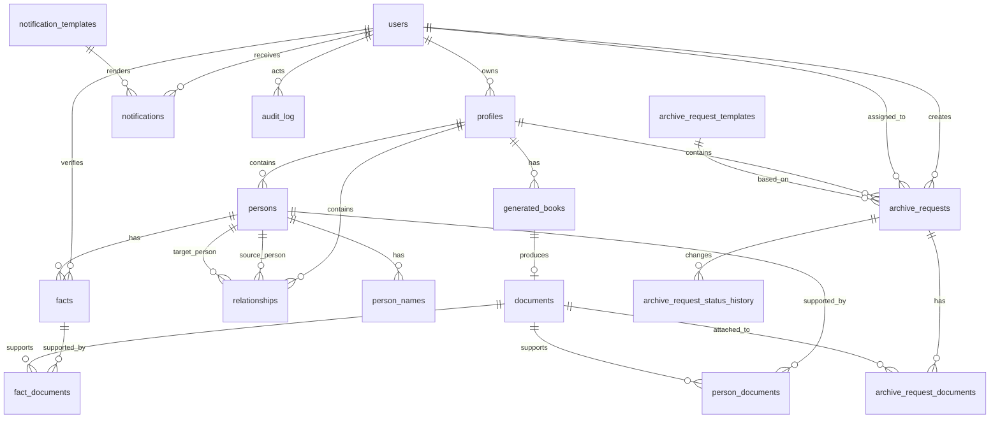

# ER Model in 3NF

ER-модель backend для `gentree` спроектирована под PostgreSQL и модульный монолит. Модель ориентирована на MVP + ближайший `V1`, при этом структура сразу приведена к 3НФ, чтобы не тащить в базу денормализованные зависимости.

## Цели модели

- хранить генеалогические профили и связанные сущности исследования;
- поддерживать роли `USER`, `GENEALOGIST`, `ADMIN`;
- описывать персон, связи, факты, архивные запросы, документы и уведомления;
- не смешивать независимые бизнес-сущности в одной таблице;
- не хранить вычисляемые или транзитивно зависимые атрибуты в родительских сущностях.

## Границы модели

В модель включены:

- `users`
- `profiles`
- `persons`
- `relationships`
- `facts`
- `archive_requests`
- `documents`
- `notifications`
- `audit`
- шаблоны и история статусов

В модель не включены как отдельные таблицы:

- JWT tokens
- OpenAPI / system metadata
- физическое файловое хранилище

## Принципы нормализации

- Каждая таблица описывает один тип сущности.
- Все поля атомарны: нет массивов ФИО, списков файлов в одной колонке, списков статусов в JSON.
- Многие-ко-многим вынесены в отдельные таблицы связей.
- История статусов и событий не хранится в строке текущей сущности.
- Метаданные шаблонов и уведомлений вынесены в отдельные сущности.
- Поля, зависящие не от ключа строки, а от другой неключевой колонки, вынесены из таблицы.

## Справочники и перечисления

На уровне PostgreSQL это можно реализовать как `ENUM` или `CHECK`.

- `user_role`: `USER`, `GENEALOGIST`, `ADMIN`
- `user_status`: `ACTIVE`, `BLOCKED`, `PENDING_VERIFICATION`
- `profile_status`: `DRAFT`, `IN_PROGRESS`, `COMPLETED`, `ARCHIVED`
- `person_sex`: `MALE`, `FEMALE`, `UNKNOWN`
- `relationship_type`: `PARENT_CHILD`, `SPOUSE`
- `fact_type`: `BIRTH`, `DEATH`, `MARRIAGE`, `RESIDENCE`, `SERVICE`, `NOTE`
- `fact_confidence`: `UNVERIFIED`, `HYPOTHESIS`, `PROBABLE`, `CONFIRMED`
- `archive_request_status`: `DRAFT`, `PREPARED`, `SENT`, `IN_PROGRESS`, `RESPONSE_RECEIVED`, `COMPLETED`, `CANCELLED`
- `document_kind`: `ARCHIVE_SCAN`, `REQUEST_DRAFT`, `REQUEST_FINAL`, `BOOK_RESULT`, `ATTACHMENT`
- `document_source_type`: `USER_UPLOAD`, `GENEALOGIST_UPLOAD`, `SYSTEM_GENERATED`, `ARCHIVE_RECEIVED`
- `notification_type`: `REQUEST_STATUS_CHANGED`, `REQUEST_NEEDS_CLARIFICATION`, `DOCUMENT_UPLOADED`, `BOOK_READY`, `SYSTEM`
- `audit_actor_type`: `USER`, `SYSTEM`

## Сущности и связи

## Таблицы

### `users`

Назначение: учётная запись субъекта системы.

| Поле | Тип | Ограничения |
|---|---|---|
| id | uuid | PK |
| email | varchar(320) | NOT NULL, UNIQUE |
| hashed_password | varchar(255) | NOT NULL |
| role | user_role | NOT NULL |
| status | user_status | NOT NULL |
| first_name | varchar(100) | NULL |
| last_name | varchar(100) | NULL |
| middle_name | varchar(100) | NULL |
| last_login_at | timestamptz | NULL |
| email_verified_at | timestamptz | NULL |
| created_at | timestamptz | NOT NULL |
| updated_at | timestamptz | NOT NULL |

Ключи и ограничения:

- `UNIQUE (email)`

### `profiles`

Назначение: контейнер генеалогического исследования.

| Поле | Тип | Ограничения |
|---|---|---|
| id | uuid | PK |
| owner_user_id | uuid | FK -> users.id, NOT NULL |
| title | varchar(255) | NOT NULL |
| description | text | NULL |
| status | profile_status | NOT NULL |
| started_at | date | NULL |
| completed_at | date | NULL |
| created_at | timestamptz | NOT NULL |
| updated_at | timestamptz | NOT NULL |

Индексы:

- `(owner_user_id)`
- `(status)`

### `persons`

Назначение: персона внутри профиля.

| Поле | Тип | Ограничения |
|---|---|---|
| id | uuid | PK |
| profile_id | uuid | FK -> profiles.id, NOT NULL |
| sex | person_sex | NOT NULL |
| birth_date | date | NULL |
| death_date | date | NULL |
| birth_place | varchar(255) | NULL |
| death_place | varchar(255) | NULL |
| notes | text | NULL |
| is_living | boolean | NOT NULL |
| created_at | timestamptz | NOT NULL |
| updated_at | timestamptz | NOT NULL |

Индексы:

- `(profile_id)`

### `person_names`

Назначение: имена и варианты именования персоны. Вынесено отдельно, чтобы не смешивать текущее имя, девичью фамилию и альтернативы в набор колонок с повторяющейся семантикой.

| Поле | Тип | Ограничения |
|---|---|---|
| id | uuid | PK |
| person_id | uuid | FK -> persons.id, NOT NULL |
| family_name | varchar(150) | NOT NULL |
| given_name | varchar(150) | NOT NULL |
| patronymic | varchar(150) | NULL |
| name_type | varchar(50) | NOT NULL |
| is_primary | boolean | NOT NULL |
| created_at | timestamptz | NOT NULL |

Ограничения:

- `CHECK (name_type IN ('PRIMARY', 'BIRTH', 'ALTERNATIVE'))`

Индексы:

- `(person_id)`

### `relationships`

Назначение: связь между двумя персонами одного профиля.

| Поле | Тип | Ограничения |
|---|---|---|
| id | uuid | PK |
| profile_id | uuid | FK -> profiles.id, NOT NULL |
| source_person_id | uuid | FK -> persons.id, NOT NULL |
| target_person_id | uuid | FK -> persons.id, NOT NULL |
| relationship_type | relationship_type | NOT NULL |
| start_date | date | NULL |
| end_date | date | NULL |
| notes | text | NULL |
| created_at | timestamptz | NOT NULL |
| updated_at | timestamptz | NOT NULL |

Ограничения:

- `CHECK (source_person_id <> target_person_id)`
- `UNIQUE (profile_id, source_person_id, target_person_id, relationship_type)`

### `facts`

Назначение: факт о персоне.

| Поле | Тип | Ограничения |
|---|---|---|
| id | uuid | PK |
| person_id | uuid | FK -> persons.id, NOT NULL |
| fact_type | fact_type | NOT NULL |
| fact_date | date | NULL |
| place | varchar(255) | NULL |
| value_text | text | NULL |
| notes | text | NULL |
| confidence | fact_confidence | NOT NULL |
| verified_by_user_id | uuid | FK -> users.id, NULL |
| verified_at | timestamptz | NULL |
| created_at | timestamptz | NOT NULL |
| updated_at | timestamptz | NOT NULL |

Индексы:

- `(person_id)`
- `(fact_type)`
- `(confidence)`

### `archive_request_templates`

Назначение: шаблоны архивных запросов.

| Поле | Тип | Ограничения |
|---|---|---|
| id | uuid | PK |
| name | varchar(255) | NOT NULL |
| description | text | NULL |
| version | integer | NOT NULL |
| storage_path | varchar(500) | NOT NULL |
| is_active | boolean | NOT NULL |
| created_by_user_id | uuid | FK -> users.id, NOT NULL |
| created_at | timestamptz | NOT NULL |

Ограничения:

- `UNIQUE (name, version)`

### `archive_requests`

Назначение: архивный запрос по конкретному профилю.

| Поле | Тип | Ограничения |
|---|---|---|
| id | uuid | PK |
| profile_id | uuid | FK -> profiles.id, NOT NULL |
| created_by_user_id | uuid | FK -> users.id, NOT NULL |
| assigned_genealogist_user_id | uuid | FK -> users.id, NULL |
| template_id | uuid | FK -> archive_request_templates.id, NULL |
| title | varchar(255) | NOT NULL |
| request_goal | text | NULL |
| current_status | archive_request_status | NOT NULL |
| requested_archive_name | varchar(255) | NULL |
| outgoing_number | varchar(100) | NULL |
| sent_at | timestamptz | NULL |
| due_at | timestamptz | NULL |
| completed_at | timestamptz | NULL |
| created_at | timestamptz | NOT NULL |
| updated_at | timestamptz | NOT NULL |

Индексы:

- `(profile_id)`
- `(created_by_user_id)`
- `(assigned_genealogist_user_id)`
- `(current_status)`

### `archive_request_status_history`

Назначение: история смены статусов архивного запроса.

| Поле | Тип | Ограничения |
|---|---|---|
| id | uuid | PK |
| archive_request_id | uuid | FK -> archive_requests.id, NOT NULL |
| from_status | archive_request_status | NULL |
| to_status | archive_request_status | NOT NULL |
| changed_by_user_id | uuid | FK -> users.id, NULL |
| comment | text | NULL |
| created_at | timestamptz | NOT NULL |

Индексы:

- `(archive_request_id, created_at)`

### `documents`

Назначение: универсальная карточка документа без привязки к одному типу объекта.

| Поле | Тип | Ограничения |
|---|---|---|
| id | uuid | PK |
| uploaded_by_user_id | uuid | FK -> users.id, NULL |
| document_kind | document_kind | NOT NULL |
| source_type | document_source_type | NOT NULL |
| file_name | varchar(255) | NOT NULL |
| mime_type | varchar(100) | NOT NULL |
| file_size_bytes | bigint | NOT NULL |
| storage_path | varchar(500) | NOT NULL |
| checksum_sha256 | char(64) | NULL |
| original_created_at | timestamptz | NULL |
| created_at | timestamptz | NOT NULL |

Индексы:

- `(document_kind)`
- `(uploaded_by_user_id)`

### `person_documents`

Назначение: связь документа с персоной.

| Поле | Тип | Ограничения |
|---|---|---|
| id | uuid | PK |
| person_id | uuid | FK -> persons.id, NOT NULL |
| document_id | uuid | FK -> documents.id, NOT NULL |
| relation_type | varchar(50) | NOT NULL |
| created_at | timestamptz | NOT NULL |

Ограничения:

- `UNIQUE (person_id, document_id, relation_type)`

### `fact_documents`

Назначение: связь документа с фактом.

| Поле | Тип | Ограничения |
|---|---|---|
| id | uuid | PK |
| fact_id | uuid | FK -> facts.id, NOT NULL |
| document_id | uuid | FK -> documents.id, NOT NULL |
| relation_type | varchar(50) | NOT NULL |
| created_at | timestamptz | NOT NULL |

Ограничения:

- `UNIQUE (fact_id, document_id, relation_type)`

### `archive_request_documents`

Назначение: связь документа с архивным запросом.

| Поле | Тип | Ограничения |
|---|---|---|
| id | uuid | PK |
| archive_request_id | uuid | FK -> archive_requests.id, NOT NULL |
| document_id | uuid | FK -> documents.id, NOT NULL |
| relation_type | varchar(50) | NOT NULL |
| created_at | timestamptz | NOT NULL |

Ограничения:

- `UNIQUE (archive_request_id, document_id, relation_type)`

### `notification_templates`

Назначение: шаблоны системных уведомлений.

| Поле | Тип | Ограничения |
|---|---|---|
| id | uuid | PK |
| notification_type | notification_type | NOT NULL |
| channel | varchar(50) | NOT NULL |
| subject_template | varchar(255) | NULL |
| body_template | text | NOT NULL |
| is_active | boolean | NOT NULL |
| created_by_user_id | uuid | FK -> users.id, NOT NULL |
| created_at | timestamptz | NOT NULL |
| updated_at | timestamptz | NOT NULL |

Ограничения:

- `UNIQUE (notification_type, channel)`

### `notifications`

Назначение: конкретное уведомление для пользователя.

| Поле | Тип | Ограничения |
|---|---|---|
| id | uuid | PK |
| recipient_user_id | uuid | FK -> users.id, NOT NULL |
| template_id | uuid | FK -> notification_templates.id, NULL |
| notification_type | notification_type | NOT NULL |
| title | varchar(255) | NOT NULL |
| body | text | NOT NULL |
| related_archive_request_id | uuid | FK -> archive_requests.id, NULL |
| related_document_id | uuid | FK -> documents.id, NULL |
| read_at | timestamptz | NULL |
| created_at | timestamptz | NOT NULL |

Индексы:

- `(recipient_user_id, read_at)`
- `(related_archive_request_id)`

### `generated_books`

Назначение: процесс формирования генеалогической книги и его результат.

| Поле | Тип | Ограничения |
|---|---|---|
| id | uuid | PK |
| profile_id | uuid | FK -> profiles.id, NOT NULL |
| requested_by_user_id | uuid | FK -> users.id, NOT NULL |
| document_id | uuid | FK -> documents.id, NULL |
| status | varchar(50) | NOT NULL |
| started_at | timestamptz | NOT NULL |
| finished_at | timestamptz | NULL |
| error_message | text | NULL |
| created_at | timestamptz | NOT NULL |

Ограничения:

- `CHECK (status IN ('PENDING', 'IN_PROGRESS', 'SUCCEEDED', 'FAILED'))`

### `audit_log`

Назначение: журнал действий.

| Поле | Тип | Ограничения |
|---|---|---|
| id | uuid | PK |
| actor_type | audit_actor_type | NOT NULL |
| actor_user_id | uuid | FK -> users.id, NULL |
| action_type | varchar(100) | NOT NULL |
| entity_type | varchar(100) | NOT NULL |
| entity_id | uuid | NULL |
| payload_json | jsonb | NULL |
| created_at | timestamptz | NOT NULL |

Индексы:

- `(actor_user_id, created_at)`
- `(entity_type, entity_id)`
- `(action_type, created_at)`

## Почему модель в 3НФ

### 1НФ

Модель соответствует 1НФ, потому что:

- все поля атомарны;
- повторяющиеся группы вынесены в отдельные строки;
- нет колонок вида `person_1`, `person_2`, `person_3`;
- нет списков документов, статусов или уведомлений в текстовом поле.

Примеры:

- варианты имён вынесены в `person_names`, а не лежат в `persons`;
- история статусов вынесена в `archive_request_status_history`, а не хранится в JSON-массиве в `archive_requests`;
- связи документов вынесены в `person_documents`, `fact_documents`, `archive_request_documents`.

### 2НФ

Модель соответствует 2НФ, потому что:

- во всех основных таблицах используется суррогатный первичный ключ `id`;
- в таблицах связей неключевые поля зависят от всей связи, а не от её части;
- свойства шаблона, документа, уведомления или персоны не дублируются в таблицах связей.

Примеры:

- `relation_type` в `fact_documents` описывает именно связь факта и документа;
- данные файла хранятся только в `documents`, а не повторяются в таблицах привязок;
- данные пользователя не размножаются по `profiles`, `archive_requests`, `notifications`.

### 3НФ

Модель соответствует 3НФ, потому что:

- неключевые атрибуты зависят только от ключа и не зависят друг от друга транзитивно;
- вычисляемые или производные сущности отделены от родительских таблиц;
- справочные и исторические данные вынесены отдельно.

Примеры:

- в `archive_requests` хранится только текущий статус, а история вынесена в `archive_request_status_history`;
- шаблон запроса хранится в `archive_request_templates`, а не копируется как набор колонок в каждый запрос;
- шаблон уведомления хранится в `notification_templates`, а конкретное сообщение в `notifications`;
- сведения о книге вынесены в `generated_books`, а сам файл хранится в `documents`;
- имена персоны вынесены из `persons`, чтобы атрибуты альтернативного имени не зависели транзитивно от типа имени.

## Спорные места и принятые решения

### Почему роль хранится в `users`, а не в отдельной таблице `roles`

Сейчас у пользователя одна актуальная роль. Для такой модели поле `role` в `users` корректно и не нарушает 3НФ. Если позже потребуется много ролей на одного пользователя, схема должна быть расширена до `roles` + `user_roles`.

### Почему документы связаны через отдельные таблицы, а не через polymorphic FK

Потому что полиморфная ссылка вида `entity_type + entity_id` в `documents` не даёт нормальных внешних ключей и делает целостность слабой. Отдельные junction tables лучше для 3НФ и для PostgreSQL constraints.

### Почему `person_names` отделена от `persons`

Потому что у одной персоны может быть несколько форм имени, и попытка хранить это набором колонок `primary_*`, `birth_*`, `alt_*` приводит к повторяющимся группам и плохой масштабируемости.

### Почему нет отдельной таблицы для произвольного шаринга профиля

Потому что в текущих требованиях ВКР профиль принадлежит владельцу, а доступ к нему определяется ролевой моделью и участием в процессе обработки запроса. Для MVP достаточно правил доступа уровня приложения: владелец профиля, назначенный генеалог и администратор.

## MVP-срез модели

Для первой полноценной миграции достаточно включить:

- `users`
- `profiles`
- `persons`
- `person_names`
- `relationships`
- `facts`
- `archive_request_templates`
- `archive_requests`
- `archive_request_status_history`
- `documents`
- `archive_request_documents`
- `notifications`
- `notification_templates`
- `audit_log`

Можно отложить до `V1`:

- `person_documents`
- `fact_documents`
- `generated_books`

## Рекомендуемый следующий шаг

После этой ER-модели имеет смысл сразу сделать:

1. SQLAlchemy 2.0 модели для MVP-таблиц.
2. Enum-ы и ограничения.
3. Первую Alembic-миграцию.
4. Набор репозиториев и схем для `auth`, `profiles`, `persons`.
